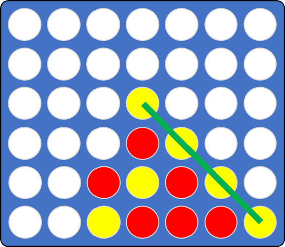
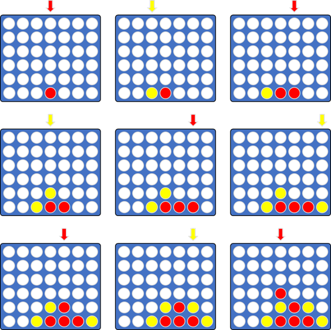

Connect Four
============

The game *Connect Four* (https://en.wikipedia.org/wiki/Connect_Four) - called *Vier gewinnt* in German - is a strategy
game for two players. It is played on a grid of six rows and seven columns. The players first choose a color (red or
yellow) and then drop one disc at a time in turns from the top of the grid. The discs fall straight down and occupy
the lowest available space of the column. The objective of the game is to connect four of your own discs to form a
horizontal, vertical, or diagonal row. The following figures show the grid in a final state and an exemplary sequence
of 9 moves.





## 1. Console Application

Your first task is to implement a command line interface (CLI) version of the game. In this repository you find a project
named ```ConnectFour``` which already contains a basic skeleton. It contains a ```Program``` file in which the input loop
is already implemented, an enum ```Player```, an ```IConnectFour``` interface, and classes for implementing the game, the
grid and its tests. Feel free to add additional classes and/or methods as needed, but do not alter the ```IConnectFour```
interface.

**Task 1.a:**  
Pair up in teams of 2 and finish the implementation by applying *pair programming* and *test-driven development (TDD)*.
Focus on a correct TDD loop (write a failing test → make the test pass → refactor).

**Task 1.b:**  
After completing your application, discuss how you experienced test-driven development and highlight your most important
insights. Furthermore, critically analyze and review the design of your application. In particular, consider how your
code might look different, if you had used a traditional development process.

## 2. Web Application and CI/CD Pipeline

Use your implementation of the game Connect Four from the previous task to create a web application and a continuous 
integration and continuous delivery (CI/CD) pipeline for it. Your CI/CD pipeline should execute the following jobs:

1. **Build**  
     Automatically build your web application (```dotnet build```)
2. **Test**  
     Run all tests (```dotnet test```)
3. **Package**  
     Create a deployable package to deploy the web application (```dotnet package```)
4. **Deploy**  
     Deploy and run your application in a Docker container on your machine

This task consists of three tasks:

**Task 2.a:**  
In this repository you find another project named ```ConnectFourWeb``` which contains a template for a simple ASP.NET web
application. Add your source code of the game from the previous task to this project and complete the web application.
Test it locally on your machine and verify that your application and all tests work as expected by executing the different
commands (```dotnet build```, ```dotnet test```, ```dotnet package```, ```dotnet run```) on the command line.

**Task 2.b:**  
Register yourself at *GitLab* (https://gitlab.com), create a new project and push the sources of your web application to
the Git repository of the project. Install a GitLab runner on your machine and register the runner for the project, as
explained in [SETUP.md](SETUP.md). Use the file named *.gitlab-ci.yml* in the root folder of the repository to define a
GitLab CI/CD pipeline which executes the steps described above.

**Task 2.c:**  
Register yourself at *GitHub* (https://github.com) and repeat the process of creating your CI/CD pipeline using GitHub
Actions. For deployment set up a self-hosted runner in a Docker container, as described in [SETUP.md](SETUP.md).
